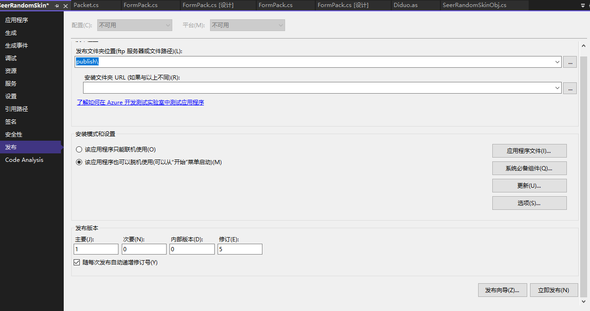

# 安装包制作方法

- 在主项目的 csproj 文件中，找到需要发布版本的 PropertyGroup（如：Release|x64），添加一行```<CefSharpBuildAction>Content</CefSharpBuildAction>```
- 双击主项目，立即发布
- 进入到 Release 出来的可执行程序目录，将 app.publish 文件夹打包分享，点击其中的 setup.exe 即可安装程序
